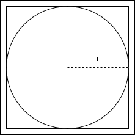
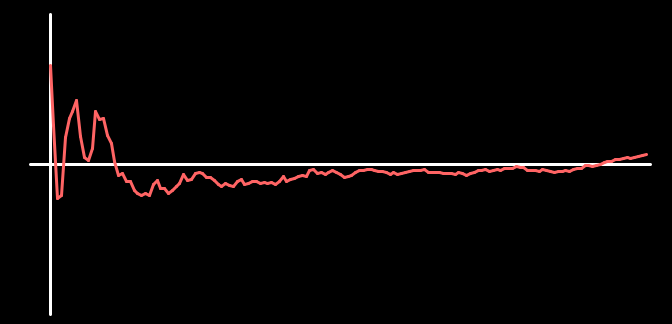

# Statistische approximierung der Kreiszahl Pi - Das Monte Carlo Prinzip

Das Monte Carlo Prinzip nutzt zufällige Erignisse um statistisch Erwartungswerte eines Systems zu ermitteln.
Die einfachste Umsetzung dieses Prinzips ist es die Kreiszahl Pi suf diese Weise zu ermitteln.

Dazu schauen wir uns das Verhältnis der Fläche eines Quadrats zu der des darin liegenden Kreises an:

Die Fläche des Quadrates berechnet sich trivial durch
$$
A_{q} = 4r^2
$$
Die Fläche des Kreises durch
$$
A_{k} = \pi r^2
$$

Demnach finden wir Pi durch die Formel
$$
\pi = 4 \frac{A_k}{A_q}
$$

In der Simulation benutzen wir nur ein Viertel des Quadrates um die Berechnungen etwas zu erleichtern, das Verhältnis der Flächen ändert sich aber nicht.

Um Pi nun zu bestimmen plazieren wir zufällig Punkte im Quadrat und zählen die Punkte die auch im Kreis liegen. Das Verhältnis der Flächen in unserer Gleichung Finden wir einfach indem wir die Punkte im Kreis(-viertel) durch die Gesamtzahl der Punkte teilen. Dieses Verhältnis konvergiert für sehr große Punktzahlen gegen die Tatsächlichen Flächenverhältnisse. Multiplizieren wir nun mit 4, erhalten wir Pi!

Der Graph an der Seite Zeigt den Abstand zum tatsächlichen Wert an.

