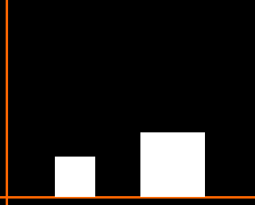
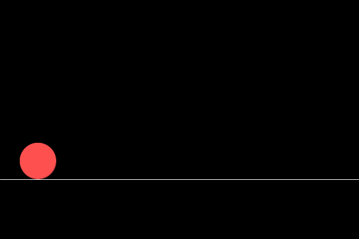

# Die Ziffern der Kreiszahl Pi in vollständig elastischen Stößen

Lässt man zwei Blöcke wie unten gezeigt miteinander und mit einer Wand (links) kollidieren, so kann es passieren, dass man unverhofft die Ziffern der Kreiszahl Pi findet.



Ist das Massenverhältnis
$$
\frac{M_{b1}}{M_{b2}} = \frac{1}{100^n}
$$
wobei b1 der kleine Block und b2 der Große block ist,
so findet man, dass die Anzahl der Stöße die n+1 Ziffern von Pi abbildet. Es gilt also
$$
n_{stoss} = \lfloor\pi \cdot(n+1)\rfloor
$$

Der genaue Physikalische zusammenhang soll hier nicht erklärt werden, da das wirklich den Ramen sprengen würde. Eine herausragende erklärung auf Englisch gibt es aber auf dem YouTube Kanal von [3Blue1Brown](https://www.youtube.com/watch?v=jsYwFizhncE).


---

## Runge Kutta 4 vs. Explizite Euler Methode

Das Problem der Bewegung haben wir bisher immer gekonnt umschifft und ohne genau darauf einzugehen die Bewegung unserer Objekte in diskreten Zeitintervallen mit hilfe der Expliziten Eulermethode gelöst. Dazu haben wir einfach die Geschwindigkeit mit einem Zeitschritt multipliziert und zur letztn Position addiert.

```Java
int zeitSchritt = letzteZeit - aktuelleZeit;
poistion = position + geschwindigkeit * zeitSchritt;
```



Diese Form der Implementierung ist sehr intuitiv. Wer sich schon etwas mit Programmierung auseinander gesetzt hat ist unter Umständen selbst auf diese Implementierung gekommen.
Das große Problem dieser Lösung ist aber, dass sie recht ungenau ist. In vielen Fällen ist das in Ordnung und die Effizienz und Einfachheit der Implementierung wiegen eventuele Ungenauigkiten auf.
Für n >= 3 passieren aber ein Großteil der Stöße in schneller Abfolge. Daher ist die höhere Genauigkeit der Runge-Kutta-4 Mehtode (RK4) den Kompromiss der geringeren Effizient definitiv wert. Konktret führt dies zu etwas mehr Grafikfehlern aber einer besseren Laufzeit aufgrund genauerer Stoßberechnungen.

Den RK4 Algorithmus herzuleiten sprengt hier den Rahmen kurz zusammen gefasst ist RK4 ein Lösungsverfahren von Differenzialgleichungen.
für eine Differentialgelichung
$$
\frac{dy}{dt}=f(y(t),t)\quad mit\quad y(0) = y_0
$$
können wir die Lösung
$$
y_{n+1}=y_n+\frac{k_1}{6}+\frac{k_2}{3}+\frac{k_4}{6}+O(h^5) \\
\quad\\
k_1 = h\cdot f(x_n,y_n)\\
\quad\\
k_2 = h\cdot f(x_n +\frac{k_1h}{2}, y_n +\frac{h}{2})\\
\quad\\
k_3 = h\cdot f(x_n +\frac{k_2h}{2}, y_n +\frac{k_1}{2})\\
\quad\\
k_4 = h\cdot f(x_n +k_3h, y_n +k_3)\\
$$

Das mag erstmal kompliziert klingen aber eigentlich ist es gar nicht so schwer. y ist die Position unseres Blocks. x ist die Geschwindigkeit unseres Blocks.
h ist der zeitSchritt den wir vornehmen, sodass
$$
x_{n+1}=h+x_n
$$
